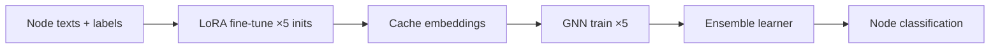

# DIVERGE

**Diverse Initializations for Vector Ensembles in Representation-aware Text-Attributed Graph Encoding with Large Language Models**

Official implementation of DIVERGE for node classification on text-attributed graphs (TAGs). The method fine-tunes an LLM multiple times with **diverse LoRA initializations**, caches complementary node embeddings, trains one GNN per embedding view, and **adaptively ensembles** their predictions.

## Abstract

Text-attributed graphs jointly encode semantic content and relational structure, yet learning effective representations remains difficult when text understanding and graph reasoning must be integrated. Recent graph–LLM hybrids improve semantic extraction but remain sensitive to representation quality and provide limited robustness when a single fine-tuned model governs downstream graph learning.

DIVERGE induces diverse, high-quality text-derived representations **without** external LLM APIs for feature augmentation. An LLM is parameter-efficiently fine-tuned multiple times on node texts and labels using diverse trainable-parameter initializations (PISSA, Gaussian, EVA, LoftQ, orthogonal). Each embedding set trains an independent GNN, forming a heterogeneous model pool. Outputs are combined via learned ensemble strategies: model-level scalar weighting, class-wise weighting, and per-class MLP weighting. Best checkpoints are selected on **validation** accuracy.

Benchmarks include **Cora**, **CiteSeer**, **PubMed**, **WikiCS**, and **OGBN-ArXiv**, with reported accuracy gains of roughly **2.32%–5.4%** over prior approaches.


## Method overview



1. **LLM fine-tuning** — Sequence-classification LoRA on node text; five initialization schemes produce diverse adapters.
2. **Embedding cache** — Mean-pooled hidden states saved per init under `artifacts/cache/`.
3. **GNN training** — Each embedding view trains a `GNNEncoder` (PyTorch Geometric) on the graph.
4. **Ensemble** — Combine GNN logits with uniform or learned weights (`learnable`, `learnable_classes`, `learnable_per_classes`).

## Repository structure

```
DIVERGE/
├── adapter_dir.py          # Paths for saved LoRA adapters under artifacts/
├── config.py               # Loads JSON configs into YACS CfgNode
├── requirements.txt
│
├── configs/                # Dataset, LLM, PEFT, and training hyperparameters
│   ├── dataset/            # cora, citeseer, pubmed, wikics, arxiv, ...
│   ├── llm_configs/        # llama_3.2_1B, llama_3.2_3B, ...
│   ├── peft_configs/       # lora.json
│   └── training_args/      # Per-dataset Hugging Face TrainingArguments
│
├── common/                 # Shared utilities
│   ├── dataloader.py       # Graph loading (.pt), splits, Node2Vec fallback
│   ├── gnn.py              # GNNEncoder (GCN, GAT, SAGE, GIN, TransformerConv)
│   ├── lm.py               # TextEncoder, pooling helpers
│   ├── metrics.py          # Accuracy / F1
│   └── ...
│
├── dataset/
│   ├── dataset_loader.py   # Text dataset for LLM fine-tuning
│   └── data_utils.py       # Load cached embeddings for GNN / ensemble
│
├── train_llm/
│   ├── train.py            # Hugging Face Trainer wrapper
│   ├── peft_model.py       # LoRA load (4-bit quant except llama_3.2_1B)
│   └── train_other_lora_init_apporaches.py  # CLI: train per init scheme
│
├── cache/
│   ├── cache_embedding.py
│   └── cache_embedding_with_diffrent_init_weights.py  # CLI: build .pt caches
│
├── gnns/
│   ├── gnn_mtrainer.py     # GNN training loop, reporting hooks
│   └── tune_gnn_hyperparameter.py
│
├── ensemble/
│   ├── ensemble_gnns_learning.py   # Ensemble + hyperparameter tuning
│   └── weight_learner_ensemble.py  # WeightLearner MLPs
│
├── experiments/            # Paper experiments and analyses
│   ├── semi_supervised_running.py
│   ├── error_rate_analysis.py
│   ├── edge_editing.py
│   ├── edge_editing_analysis.py
│   ├── ogbn_gnn_training.py
│   └── ...
│
├── visualize/              # t-SNE / PCA plots, mistake analysis
├── report/reporter.py      # Append results to results/results_output/
├── scripts/                # Batch runners (.bat / .sh)
├── gnn_hyperparameters/    # Tuned GNN configs per dataset
├── datasets/               # Graph .pt files (not in repo — see Data)
├── local_models/           # Hugging Face weights (not in repo)
└── artifacts/              # LoRA adapters + embedding caches (generated)
    ├── cache/
    └── {model}_{dataset}_seqcls_lora_...
```

## Installation

Requires **Python 3.10+**, **CUDA** (recommended), and a GPU with enough VRAM for Llama-3.2-1B LoRA (larger models use 4-bit quantization via `bitsandbytes`).

```bash
cd DIVERGE

# 1) Install PyTorch + PyG for your CUDA version (see requirements.txt comments)
pip install torch torchvision torchaudio --index-url https://download.pytorch.org/whl/cu121
# Install matching torch-geometric wheels from https://pytorch-geometric.readthedocs.io/

# 2) Remaining dependencies
pip install -r requirements.txt
```

Optional packages (only for specific experiments): `statsmodels`, `langchain-*`, `pydantic` — see comments in `requirements.txt`.

## Data and models

### Graph datasets

Download preprocessed TAG data (`.pt` graphs) from [LLMNodeBed on Hugging Face](https://huggingface.co/datasets/xxwu/LLMNodeBed/tree/main) and place files under:

```
datasets/
  cora.pt
  citeseer.pt
  pubmed.pt
  wikics.pt
  arxiv.pt
  ...
```

### Local LLM weights

Place Hugging Face checkpoints under `local_models/` (names must match `configs/llm_configs/*.json`), e.g.:

```
local_models/
  llama_3.2_1B/    # used by default configs
```

`train_llm/peft_model.py` loads `llama_3.2_1B` in bf16; other models use 4-bit quantization.

## Configuration

Runtime settings are assembled in `config.py` via `setup_finetuning_cfg(dataset_name, llm_name, peft_type)` from:

| Path | Purpose |
|------|---------|
| `configs/dataset/{name}.json` | Classes, seed, max length |
| `configs/llm_configs/{llm}.json` | Model path, target modules, batch size |
| `configs/peft_configs/lora.json` | Rank, alpha, default init |
| `configs/training_args/{name}.json` | Epochs, LR, eval/save strategy |

GNN hyperparameters for each dataset live in `gnn_hyperparameters/{dataset}.json` (and `*_semi_supervised.json`).

## LoRA initialization schemes

Each run varies `cfg.peft.init_lora_weights`:

| Init | Description |
|------|-------------|
| `pissa` | Principal Singular values and Singular vectors Adaptation |
| `gaussian` | Random Gaussian initialization |
| `eva` | EVA-style init |
| `loftq` | LoftQ quantization-aware init |
| `orthogonal` | Orthogonal initialization |

## End-to-end pipeline (supervised)

Run from the **repository root**.

### Step 1 — Fine-tune LLM (five inits)

```bash
python -m train_llm.train_other_lora_init_apporaches \
  --dataset_name cora --llm_name llama_3.2_1B --peft_type lora \
  --init_weight_approach pissa
```

Repeat for `gaussian`, `eva`, `loftq`, `orthogonal`, or use:

```bash
scripts\run_all_datasets_lora_init.bat    # Windows
scripts/run_ensemble_edge_editting.sh     # Linux/macOS (edit DATASETS first)
```

Adapters are saved under `artifacts/{model}_{dataset}_seqcls_lora_semi_supervised_init_type_{init}/` (supervised naming may omit `_semi_supervised` depending on script).

### Step 2 — Cache node embeddings

```bash
python -m cache.cache_embedding_with_diffrent_init_weights \
  --dataset_name cora --llm_name llama_3.2_1B --peft_type lora \
  --init_weight_approach pissa --pooling mean
```

Produces files such as:

```
artifacts/cache/llama_3.2_1B_cora_seqcls_lora_init-pissa_pool-mean.pt
```

### Step 3 — Train GNNs + ensemble

**Option A — Error-rate / main ensemble experiment**

Edit dataset name in `experiments/error_rate_analysis.py` or run:

```bash
python -m experiments.semi_supervised_running --dataset_name cora
```

**Option B — Semi-supervised setting**

1. Train + cache with `--split 0` (see `scripts/run_semi_supervised.bat`).
2. Tune GNN: `python -m gnns.tune_gnn_hyperparameter --dataset_name citeseer --re_split 0`
3. Run: `python -m experiments.semi_supervised_running --dataset_name citeseer`

### Ensemble weighting modes

Set `weight_approach` in `ensemble_gnn_learning()` or `tune_ensemble_hyperparameter()`:

| Mode | Meaning |
|------|---------|
| `uniform` | Equal average of GNN logits |
| `learnable` | MLP learns per-model scalar or sample weights |
| `learnable_classes` | Weight matrix `[num_models × num_classes]` |
| `learnable_per_classes` | Separate MLP per class over model logits |

Hyperparameter search and best-checkpoint selection use **validation** accuracy.

## Scripts reference

| Script | Purpose |
|--------|---------|
| `scripts/run_all_datasets_lora_init.bat` | Train LoRA across inits × datasets |
| `scripts/run_semi_supervised.bat` | Semi-supervised train → cache → GNN tune → ensemble |
| `scripts/run_ensemble_edge_editting.bat` | Edge-editing ensemble experiment |
| `scripts/ogbn_run_gnn_scripts.bat` | OGBN-ArXiv GNN training from cached logits |
| `scripts/run_lora_init_approaches.bat` | LoRA init ablations |

Edit `DATASETS`, `LLM_NAME`, and `INIT_APPROACHES` inside each script before running.

## Experiments (optional modules)

| Module | Description |
|--------|-------------|
| `experiments/edge_editing.py` | Structure-aware edge editing + ensemble |
| `experiments/edge_editing_analysis.py` | Threshold / similarity analysis |
| `experiments/edge_similrity_detecting.py` | Edge similarity diagnostics |
| `experiments/info_embeddings.py` | Embedding quality metrics (PCA, t-SNE, KL, etc.) |
| `experiments/enahnce_textual_embeddings.py` | LLM-based text augmentation (LangChain; optional) |
| `experiments/retrain_llm_with_gnn_mistakes.py` | Retrain on GNN mistake nodes |
| `experiments/hypothesis_testing_fintuned_unfinetuned.py` | McNemar test vs. baselines |
| `experiments/ogbn_gnn_training.py` | ArXiv-scale GNN training CLI |
| `visualize/visualize_gnn_mistakes.py` | Mistake visualization |

## Outputs

| Location | Contents |
|----------|----------|
| `artifacts/` | LoRA adapters |
| `artifacts/cache/` | Cached LLM embeddings (`.pt`) |
| `results/results_output/` | Metrics text reports via `ReportResults` |
| `results/train_info/` | Training logs |
| `results/edge_analysis/` | Edge-editing CSVs / plots |

## Supported datasets

Configured under `configs/dataset/`: **cora**, **citeseer**, **pubmed**, **wikics**, **arxiv**, plus **computer**, **photo**, **history**, **reddit**, **instagram**, **book** for extended experiments.

## Citation

If you use this code, please cite the DIVERGE paper (bibtex to be added).

## Acknowledgments

- Graph data: [LLMNodeBed](https://huggingface.co/datasets/xxwu/LLMNodeBed/tree/main)
- Built on [PyTorch](https://pytorch.org/), [PyTorch Geometric](https://pytorch-geometric.readthedocs.io/), [Hugging Face Transformers](https://huggingface.co/docs/transformers), and [PEFT](https://huggingface.co/docs/peft)
